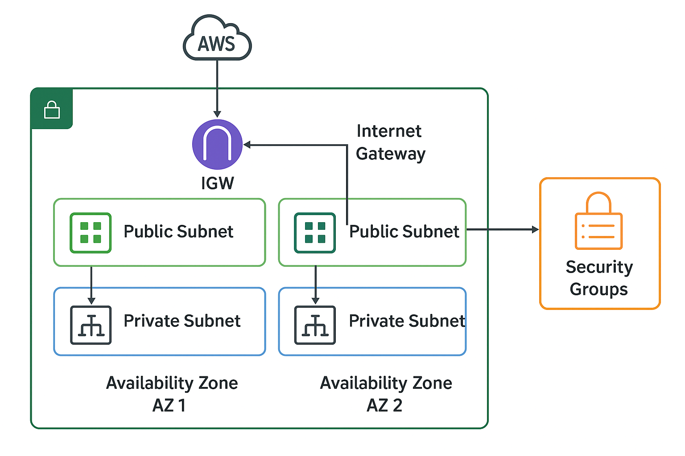

# AWS Networking Architecture with Terraform 

## Overview

This project was built as part of a networking and terraform exercise focused on clean modular infrastructure design, reproducible deployments and to demonstrate practical understanding of:

- AWS VPC design
- Public and private subnet segmentation
- Route table configuration
- Internet access control
- Security group management
- Infrastructure as Code (IaC)

**Region:** `eu-west-1`

---

## Architecture Diagram



---

## Design Decisions

- **Public** and **private subnets** are separated to isolate internet-facing and internal resources.
- **Route tables** are explicitly associated to control traffic flow between subnets.
- **Security groups** follow least-privilege principles for inbound and outbound traffic.
- **Terraform** is used to ensure infrastructure is reproducible and version-controlled.

---

## Terraform Structure

```text
infra/
├── provider.tf
├── main.tf
├── variables.tf
├── outputs.tf
├── vpc.tf
├── subnets.tf
├── routes.tf
└── security_groups.tf
```

---

## Deployment Prerequisites
- AWS account
- AWS CLI configured
- Terraform installed

---

## Deployment Evidence
### AWS Infrastructure

VPC and subnet resources created successfully in AWS:


### Terraform Provisioning
Terraform successfully provisioning the infrastructure: 


---

## Validation

- Verified VPC and subnet creation in AWS Console
- Confirmed public subnet internet routing
- Confirmed route table associations
- Validated Terraform syntax and formatting

---

## Key Learnings

- Improved understanding of AWS VPC architecture
- Practiced subnet segmentation and routing concepts
- Gained experience using Terraform for Infrastructure as Code
- Learned how to structure Terraform configurations cleanly

---

## Future Improvements

- Add NAT Gateway for private subnet outbound access
- Expand architecture across multiple availability zones
- Introduce Network ACL configurations
- Refactor into reusable Terraform modules

---

## Resources
- Terraform Documentation
- AWS VPC Documentation 

